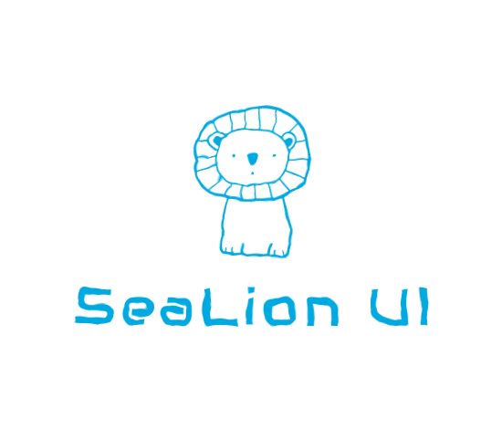
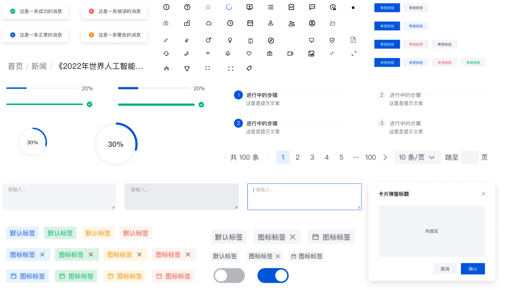

<div align="center"><a name="readme-top"></a>


<h3>SeaLion UI是一套轻量化且易于拓展的React组件库</h3>
<br/>
<div>


</div>
<br/>

</div>

# 特点
<ul>
    <li>完全基于面性风格开发样式，可以显著减少类似风格的高保真工作</li>
    <li>轻量，不依赖antdUI或者其他任何组件库；</li>
    <li>考虑到目前的资源，sea-lion不会去适配可见未来内项目不需要场景和功能（比如ssr），所以代码会相对简单，便于新增功能；</li>
</ul>

# 安装
1. 创建项目
```sh
> cls create hello-app # 使用sea-lion-client创建一个项目
> cd hello-app
> npm i sea-lion-app
```
[什么是cls？](https://www.npmjs.com/package/sea-lion-client)
<br/>
<br/>

2. 首先全局import样式

### app.tsx
```js
import 'sea-lion-ui/dist/index.css';
```

3. 在业务代码使用
### hello.tsx
```js
import React from 'react';
import { useIntl } from 'react-intl';
import { Button, IconFont } from 'sea-lion-ui';

const Hello = () => {
    const Intl = useIntl();

    return (
        <div>
            {
                Intl.formatMessage({
                    id: 'hello',
                    defaultMessage: '嗨'
                })
            }
            <Button type="primary" disabled>
                <IconFont icon="icon-CompassionOutlined" />
                hello
            </Button>
        </div>
    );
};

export default Hello;
```

# 命令
```sh
# 运行开发环境
npm run dev

# 打包
npm run build
```
# 发布
以下两个命令选择一个执行即可：
```sh
# interactive and allows you to confirm each task before execution
npm run release
# or auto increase version on patch
npm run release-auto;

# more info: https://github.com/release-it/release-it
```

# 组件开发
1. 首先checkout一个功能分支，分支名为：feat-cmp-xxx，xxx为需要开发的组件名，比如开发button组件，分支名为：feat-cmp-button
2. 发布成功后提一个mr，合并到develop分支，管理员代码审核通过后会通过mr，然后合并到main。

